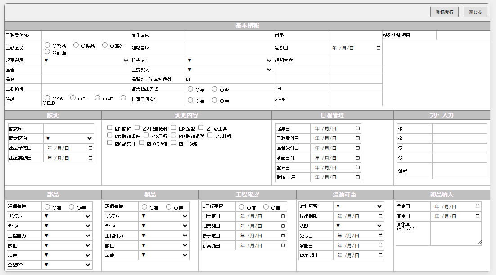
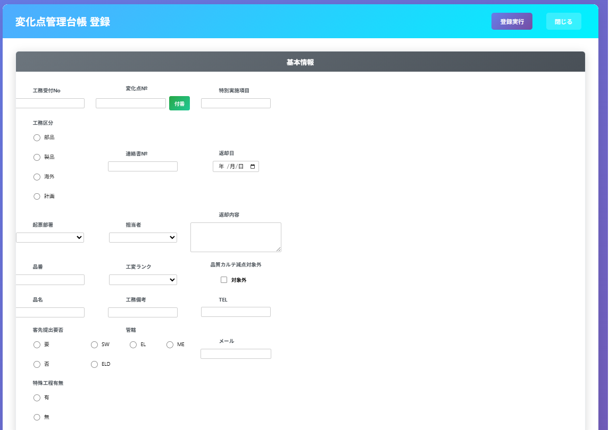
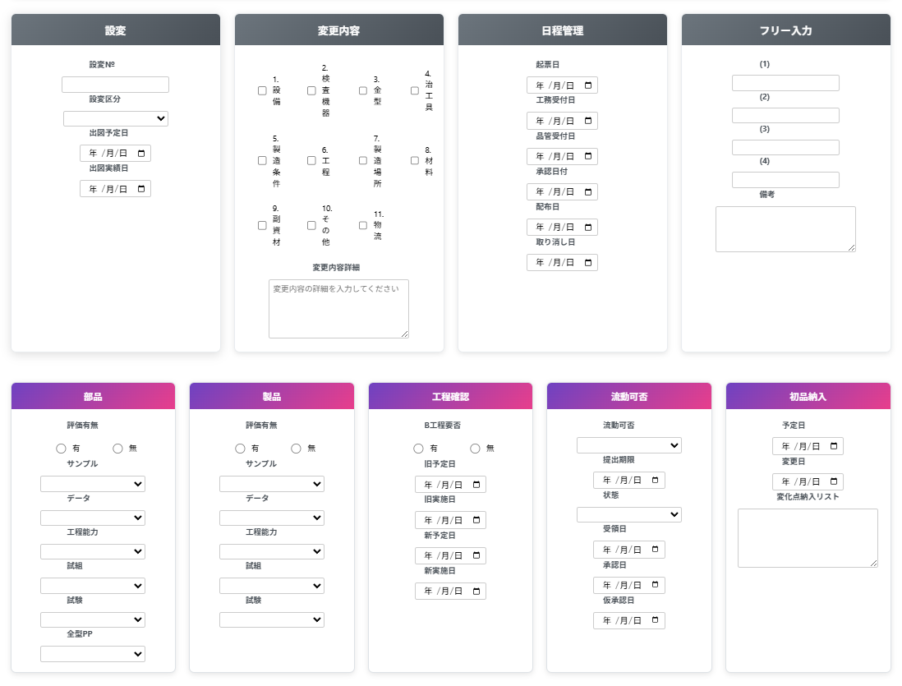

# プロンプト履歴（完全記録）

このファイルは、ユーザーが入力したプロンプトを一字一句正確に記録するためのドキュメントです。
誤字脱字も含めて、入力された通りに記録します。

---

## プロンプト #1
**日時**: 2025-09-03
```
これからあるELIMSというシステムの一部機能をpythonでwebアプリケーションとして立ち上げたいと思います。
ELIMSのデータはSQL Serverに格納されています。
あるテーブルをもとに機能を作っていきたいので、必要な情報を私に聞いてもらって、一緒に作っていきましょう。
```

## プロンプト #2
**日時**: 2025-09-03
```
まず１について進めます。テーブル名はTC_変化点管理台帳ですが、カラムやデータ型をお伝えするのは大変なので、自分で確認してください。確認してもらうために、SQL Serverのログイン情報をお伝えします。ログイン情報は下記です。
サーバー名：192.168.1.19\SQLEXPRESS
認証：SQL Server 認証
ログイン：ELIMS
パスワード：devin
```

## プロンプト #3
**日時**: 2025-09-03
```
ログイン情報が間違っていました。
ユーザー名がdevinで、パスワードがelhinです。
```

## プロンプト #4
**日時**: 2025-09-03
```
まずは、最新のレコードの内容を教えてください
```

## プロンプト #5
**日時**: 2025-09-03
```
ちょっとここで進め方の補足をします。
私が指示した内容とあなたの思考と処理プロセスを、後で他の方に説明できるよう、遂次ドキュメントに残すようにしてください。
```

## プロンプト #6
**日時**: 2025-09-03
```
後ほど、アプリケーションの作成の方法について説明する際、私がどのような指示をしたのか正確にわかる方が説得力があるので、プロンプトを正確に残すようにしてください（このプロンプトも含む）
なお、自然言語でどの程度のアプリケーションを構築できるかを、ClaudeCodeを知らない人にイメージを持ってもらうのが一つの目的です。
```

## プロンプト #7
**日時**: 2025-09-03
```
ありがとうございます。ちゃんと正確に残ってて良いです。
ただ、資料としてわかりにくくなってしまったので、PROJECT_DOCUMENTATION.mdについては、先ほどまでの方針で整理してくれればいいので、プロンプトについては、別のmdファイルを作って、全てそこに記録するようにしてください（誤字脱字があればそれも含めて正確に記す）
```

## プロンプト #8
**日時**: 2025-09-03
```
では、開発に戻りましょう。画面イメージを伝えたいので、画面イメージ保存用のフォルダを作ってください。それから、何かしらの画像データについては、そのフォルダにいれるので、今後そこを見に行くよう、設定を施してください。
```

## プロンプト #9
**日時**: 2025-09-03
```
.gitignoreを作成して、github管理しない一般的なファイルをそこに記述してください
```

## プロンプト #10
**日時**: 2025-09-03
```
initial commit完了しました。
次は、登録画面.pngを見て、TC_変化点管理台帳テーブルの登録機能を作ってください
```

## プロンプト #11
**日時**: 2025-09-03
```
画像からのイメージの再現がいまいちだったので、登録画面.xlsxを見て、より正確にweb版の画面を作成してください。
```

**実行結果画面:**


## プロンプト #12
**日時**: 2025-09-04
```
登録画面の調整に戻ります。☑、〇、▼は文字としては不要です。削除してください。
```

## プロンプト #13
**日時**: 2025-09-04
```
下記レイアウト修正をしてください。
１．工務区分が、改行されてしまい2行分とっています。それぞれの選択肢の間を詰めて、1行分で表示されるようにしてください。
２．「付番」は項目ではなく、「変化点No.」を付番するためのボタンです。変化点No.の右辺りに付番ボタンを配置してください。
３．「付番」をボタンにすると、そのスペースが空きますので、そのスペースに「特別実施項目」を入れてください。
４．返却内容は3行分で1項目です。備考や変化点納入リストと同様、セルを結合したイメージにしてください。
５．変更内容セクションの各チェックの下のスペースに、フリー入力欄を作成してください。
```

## プロンプト #14
**日時**: 2025-09-04
```
変更内容セクションのフリー入力欄は、ひとつひとつのチェック項目の下ではなく、全てまとめた入力欄です。テキストボックス１つでお願いします。それから、枠線をつけてください
```

## プロンプト #15
**日時**: 2025-09-04
```
全体的な配置はこれでOKです。次は、この配置を維持しつつ、webアプリケーションらしいUIデザインにしてください。
```

**実行結果**: 
- `/mnt/c/ClaudeCode/APPS/ELIMS/templates/register_modern.html` を作成
- モダンなウェブアプリケーションのUIデザインを適用
- グラデーション背景、カードレイアウト、ホバー効果、現代的なフォームスタイリングを実装
- app.py を更新してモダンテンプレートを使用するよう変更
- Flaskアプリケーションが http://127.0.0.1:5000 で正常に起動

**実行結果画面:**



---

*注: 今後のプロンプトも、入力された通りに正確にこのファイルに追記していきます。*