# プロンプト履歴（完全記録）

このファイルは、ユーザーが入力したプロンプトを一字一句正確に記録するためのドキュメントです。
誤字脱字も含めて、入力された通りに記録します。

---

## プロンプト #1
**日時**: 2025-09-03
```
これからあるELIMSというシステムの一部機能をpythonでwebアプリケーションとして立ち上げたいと思います。
ELIMSのデータはSQL Serverに格納されています。
あるテーブルをもとに機能を作っていきたいので、必要な情報を私に聞いてもらって、一緒に作っていきましょう。
```

## プロンプト #2
**日時**: 2025-09-03
```
まず１について進めます。テーブル名はTC_変化点管理台帳ですが、カラムやデータ型をお伝えするのは大変なので、自分で確認してください。確認してもらうために、SQL Serverのログイン情報をお伝えします。ログイン情報は下記です。
サーバー名：192.168.1.19\SQLEXPRESS
認証：SQL Server 認証
ログイン：ELIMS
パスワード：devin
```

## プロンプト #3
**日時**: 2025-09-03
```
ログイン情報が間違っていました。
ユーザー名がdevinで、パスワードがelhinです。
```

## プロンプト #4
**日時**: 2025-09-03
```
まずは、最新のレコードの内容を教えてください
```

## プロンプト #5
**日時**: 2025-09-03
```
ちょっとここで進め方の補足をします。
私が指示した内容とあなたの思考と処理プロセスを、後で他の方に説明できるよう、遂次ドキュメントに残すようにしてください。
```

## プロンプト #6
**日時**: 2025-09-03
```
後ほど、アプリケーションの作成の方法について説明する際、私がどのような指示をしたのか正確にわかる方が説得力があるので、プロンプトを正確に残すようにしてください（このプロンプトも含む）
なお、自然言語でどの程度のアプリケーションを構築できるかを、ClaudeCodeを知らない人にイメージを持ってもらうのが一つの目的です。
```

## プロンプト #7
**日時**: 2025-09-03
```
ありがとうございます。ちゃんと正確に残ってて良いです。
ただ、資料としてわかりにくくなってしまったので、PROJECT_DOCUMENTATION.mdについては、先ほどまでの方針で整理してくれればいいので、プロンプトについては、別のmdファイルを作って、全てそこに記録するようにしてください（誤字脱字があればそれも含めて正確に記す）
```

## プロンプト #8
**日時**: 2025-09-03
```
では、開発に戻りましょう。画面イメージを伝えたいので、画面イメージ保存用のフォルダを作ってください。それから、何かしらの画像データについては、そのフォルダにいれるので、今後そこを見に行くよう、設定を施してください。
```

## プロンプト #9
**日時**: 2025-09-03
```
.gitignoreを作成して、github管理しない一般的なファイルをそこに記述してください
```

## プロンプト #10
**日時**: 2025-09-03
```
initial commit完了しました。
次は、登録画面.pngを見て、TC_変化点管理台帳テーブルの登録機能を作ってください
```

## プロンプト #11
**日時**: 2025-09-03
```
画像からのイメージの再現がいまいちだったので、登録画面.xlsxを見て、より正確にweb版の画面を作成してください。
```

**実行結果画面:**


## プロンプト #12
**日時**: 2025-09-04
```
登録画面の調整に戻ります。☑、〇、▼は文字としては不要です。削除してください。
```

## プロンプト #13
**日時**: 2025-09-04
```
下記レイアウト修正をしてください。
１．工務区分が、改行されてしまい2行分とっています。それぞれの選択肢の間を詰めて、1行分で表示されるようにしてください。
２．「付番」は項目ではなく、「変化点No.」を付番するためのボタンです。変化点No.の右辺りに付番ボタンを配置してください。
３．「付番」をボタンにすると、そのスペースが空きますので、そのスペースに「特別実施項目」を入れてください。
４．返却内容は3行分で1項目です。備考や変化点納入リストと同様、セルを結合したイメージにしてください。
５．変更内容セクションの各チェックの下のスペースに、フリー入力欄を作成してください。
```

## プロンプト #14
**日時**: 2025-09-04
```
変更内容セクションのフリー入力欄は、ひとつひとつのチェック項目の下ではなく、全てまとめた入力欄です。テキストボックス１つでお願いします。それから、枠線をつけてください
```

## プロンプト #15
**日時**: 2025-09-04
```
全体的な配置はこれでOKです。次は、この配置を維持しつつ、webアプリケーションらしいUIデザインにしてください。
```

**実行結果**: 
- `/mnt/c/ClaudeCode/APPS/ELIMS/templates/register_modern.html` を作成
- モダンなウェブアプリケーションのUIデザインを適用
- グラデーション背景、カードレイアウト、ホバー効果、現代的なフォームスタイリングを実装
- app.py を更新してモダンテンプレートを使用するよう変更
- Flaskアプリケーションが http://127.0.0.1:5000 で正常に起動

**実行結果画面:**


## プロンプト #16
**日時**: 2025-09-04
```
画面の調整に戻ります。空白スペースが目立つので、各項目の配置を見直してください。それから、紫とか青とか、色がうるさいです。使用する色を1系統に絞って、配色に統一感を出してください。
```

**実行結果**: 
- レイアウトの密度を向上：グリッドgapを20px→12px、パディングを調整
- 色彩をブルー系統に統一：背景、ボタン、アクセントをすべて#2196f3系に変更
- 紫系のグラデーション（#6f42c1、#e83e8c）をブルー系（#1976d2、#1565c0）に変更
- スペーシングを最適化：margin、padding値を縮小してコンパクト化

**実行結果画面:**
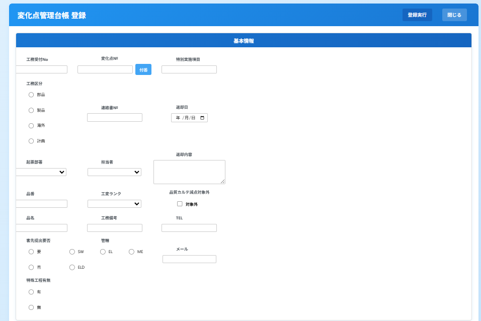
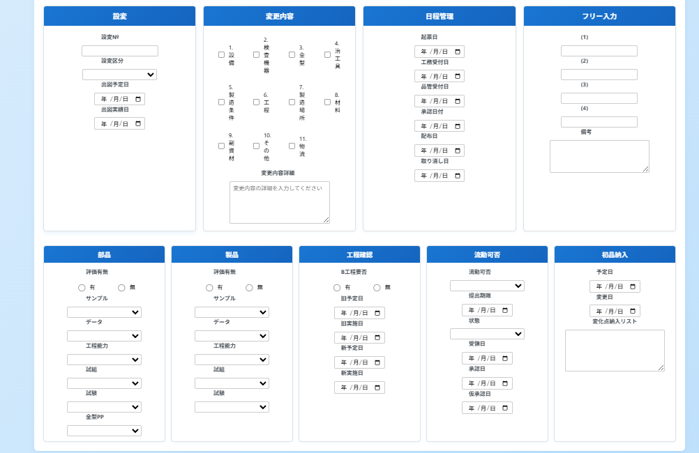

## プロンプト #17
**日時**: 2025-09-04
```
配色はよくなりました。でも余白のスペースが改善されていません。いったん最初の配置のことは忘れて、無駄な余白ができないよう、各セクションごとに項目を最適と思われる配置にしてください。
```

**実行結果**: 
- レイアウトシステムを全面的に見直し、無駄な余白を徹底的に削減
- 基本情報セクション：grid-rowをcompact-rowとform-group-inlineに変更、横並びレイアウトで密度向上
- ラジオボタン：radio-group-compactとradio-group-verticalを導入、コンパクト表示を実現
- 詳細セクション：detail-compactクラスでパディング・マージンを最小化（padding: 8px、gap: 6px等）
- 4カラムレイアウト：auto-fitとminmax(300px, 1fr)でレスポンシブかつ効率的な配置
- フォント・要素サイズを調整：詳細部分のラベルを12px、入力欄を13px、パディングを4px 8pxに縮小

**実行結果画面:**
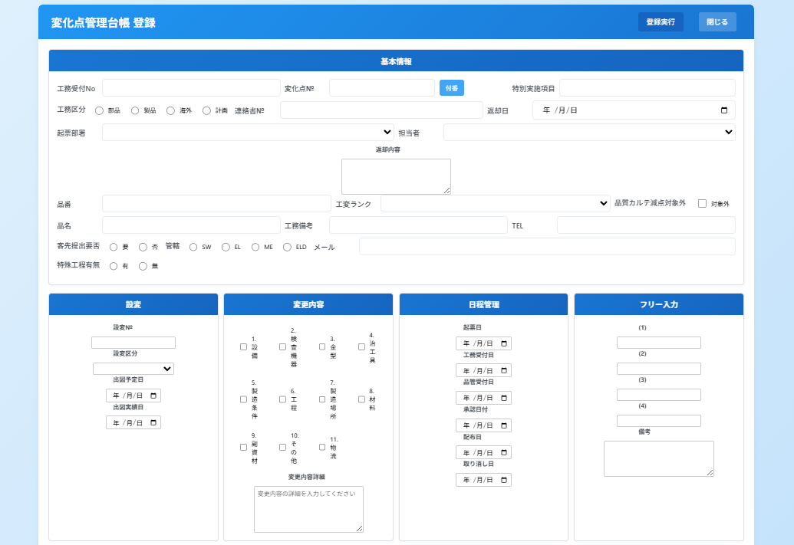
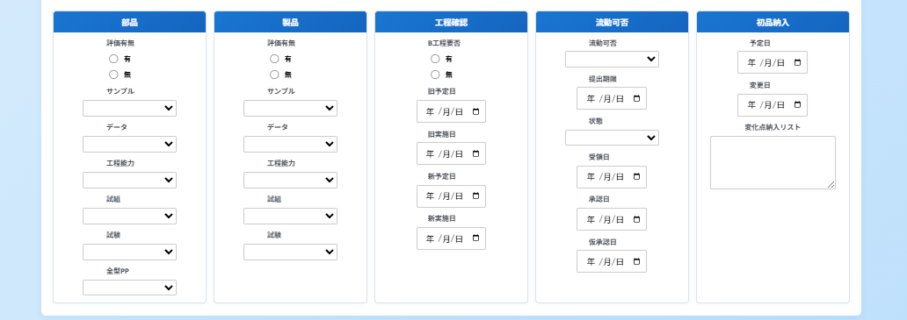

## プロンプト #18
**日時**: 2025-09-04
```
1ページで作るのがよくないでしょうか、、いまいちです。
セクションが3段に分かれているので、3段階のマルチステップフォームで作り直してください。
```

**実行結果**: 
- 3段階のマルチステップフォームに全面的に再設計
- ステップ1：基本情報（工務受付No、変化点No、工務区分、品番・品名等の基礎データ）
- ステップ2：詳細情報（設変、変更内容、日程管理、フリー入力の4カラムレイアウト）
- ステップ3：備考・最終確認（目的内容、備考、最終確認者・日付）
- プログレスインジケーター：円形ステップ番号と進行線で視覚的にステップ進行を表示
- ナビゲーション：「次へ」「戻る」「登録実行」ボタンによる段階的操作
- JavaScript：nextStep()、prevStep()関数でスムーズな画面遷移とステップ管理を実装

**実行結果画面:**
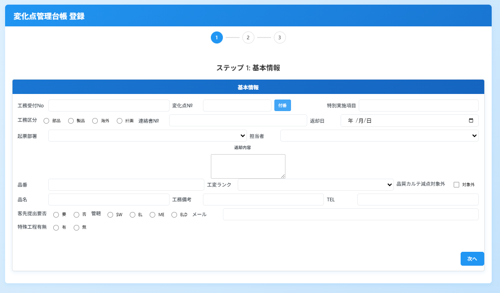
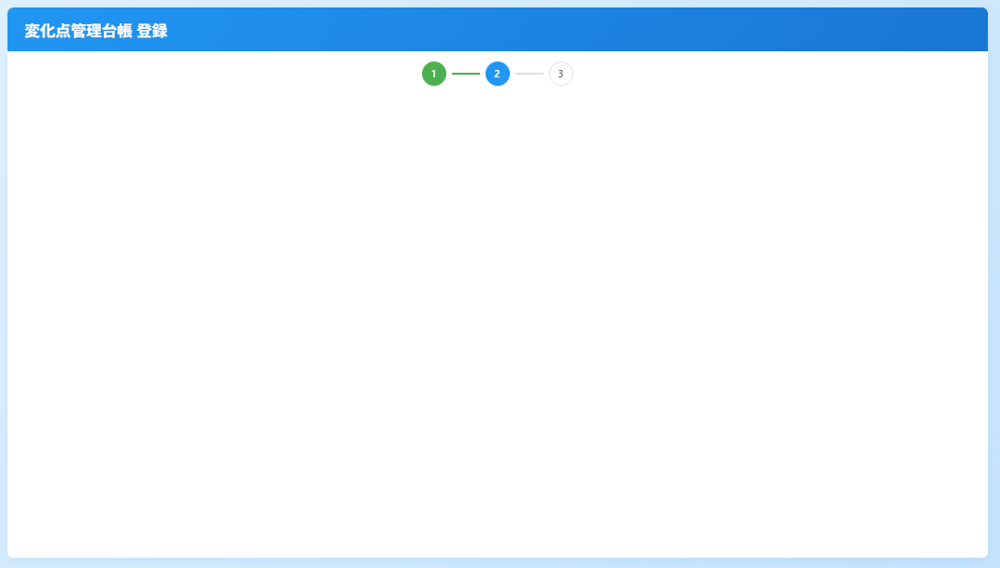

## プロンプト #19
**日時**: 2025-09-04
```
2ページ目と3ページ目が表示されません。
```

## プロンプト #20
**日時**: 2025-09-04
```
まだダメです。
```

## プロンプト #21
**日時**: 2025-09-04
```
直っていません。2ページ目には戻るボタンも次へボタンもありません。まずは、ボタンだけでも表示するところからお願いします
```

## プロンプト #22
**日時**: 2025-09-04
```
赤い枠線のボタンは表示されません。何を伝えれば不具合解消できますか？
```

## プロンプト #23
**日時**: 2025-09-04
```
ブラウザはクロームです。
err_imagesフォルダにエラー1.pngという画像を入れました。特にエラーは出ていません。
```

**注**: ユーザーがエラー画面のスクリーンショットを提供。JavaScriptは動作しているがCSSの問題でステップ2,3が表示されていないことが判明。

## プロンプト #24
**日時**: 2025-09-04
```
テストフォームは機能しています。
```

## プロンプト #25
**日時**: 2025-09-04
```
相変わらずダメです。テスト用フォームの方に、それぞれのセクションの情報を載せてみてください
```

## プロンプト #26
**日時**: 2025-09-04
```
動きました。これをベースにメインページを修正していきましょう。
メインページの修正の前に、各ページに入れる項目の整理をしたいので、各ページの要件定義案を作ってください。それから、ここまでうまくいっていない分のプロンプトもPROMPT_HISTORYに記載してください。
```

**実行結果**: 
- PAGE_REQUIREMENTS.md を作成：3ステップの詳細な要件定義を文書化
- test_working.html を作成：実際のフォーム内容を含む動作確認版（http://127.0.0.1:5000/working）
- PROMPT_HISTORY.md を更新：プロンプト#19〜#26を追加

**実行結果画面:**
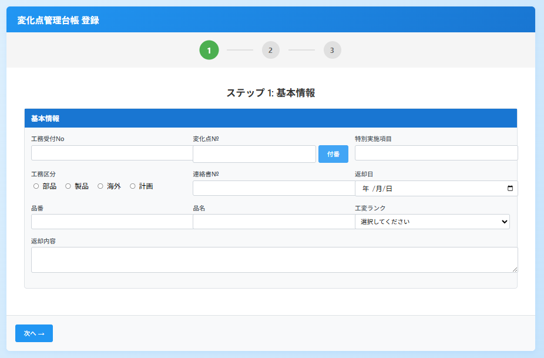
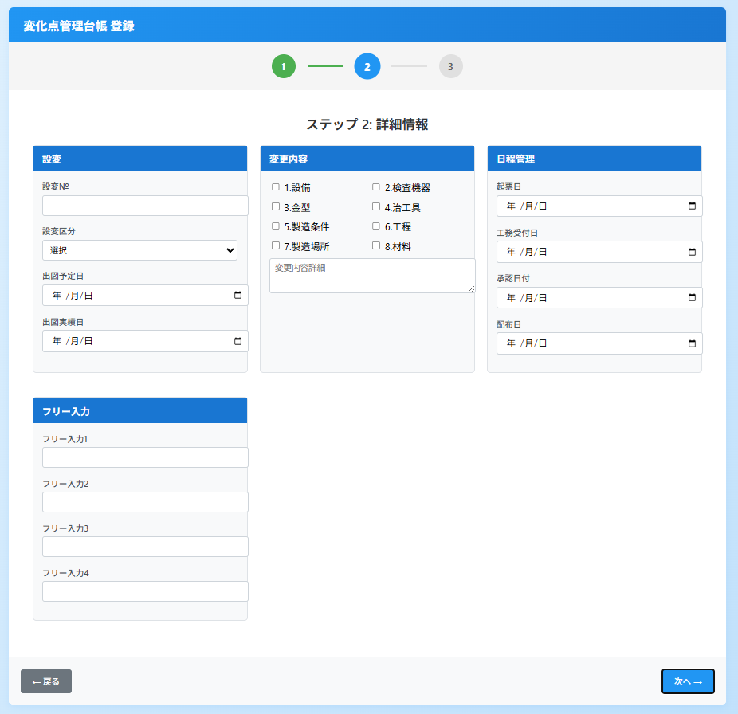
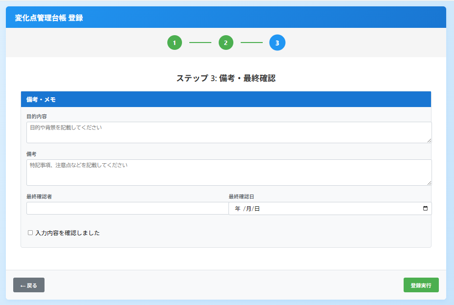

## プロンプト #27
**日時**: 2025-09-04
```
実装に戻ります。定義した要件に従って、画面作成をお願いします。
```

**実行結果**: 
- PAGE_REQUIREMENTS.mdの定義に基づいて、register_modern_new.htmlを実装
- app.pyを更新して新しいテンプレートを使用するよう変更
- 3段階のマルチステップフォームを完全実装：
  - ステップ1: 基本情報（3カラムレイアウト、工務・品目関連、変化点・担当情報、返却・連絡情報）
  - ステップ2: 詳細情報（4カラムレイアウト、設変、変更内容、日程管理、フリー入力セクション）
  - ステップ3: 備考・最終確認（目的内容、備考、承認情報、確認チェック）
- プログレスインジケーター、JavaScript navigation、CSS styling完備
- Flaskアプリケーションが http://127.0.0.1:5000 で正常に動作確認完了

## プロンプト #28
**日時**: 2025-09-04
```
OKです。下記修正をお願いします。
１．次へボタンは右下に配置してください。
２．フリー入力セクションの備考がなくなっています。3ページ目の備考はフリー入力セクションに含めてください。
３．部品・製品・工程確認・流動可否・初品納入のセクションがなくなっています。登録画面.xlsxを確認して復活させてください。
４．上記踏まえて要件定義書を修正してください。
```

**実行結果**: 
- 登録画面.xlsxを詳細分析して不足セクションを特定
- PAGE_REQUIREMENTS.mdを修正：
  - フリー入力セクションに備考フィールドを追加
  - 部品・製品・工程確認・流動可否・初品納入の5つのセクションを復活
  - ナビゲーションボタンの右下配置を明記
- register_modern_new.htmlを更新：
  - ナビゲーションボタンを右下配置（justify-content: flex-end）
  - フリー入力セクションに備考テキストエリア（4行）を追加
  - 評価・管理セクション（5カラムレイアウト）を追加：
    - 部品評価（評価有無、サンプル、データ、工程能力、試組、試験、全型PP）
    - 製品評価（評価有無、サンプル、データ、工程能力、試組、試験）
    - 工程確認（B工程要否、旧予定日、旧実施日、新予定日、新実施日）
    - 流動可否（流動可否、提出期限、状態、受領日、承認日、仮承認日）
    - 初品納入（予定日、変更日、実績初、実績終、変化点納入リスト）
  - evaluation-gridクラスのCSSスタイル追加

**実行結果画面:**
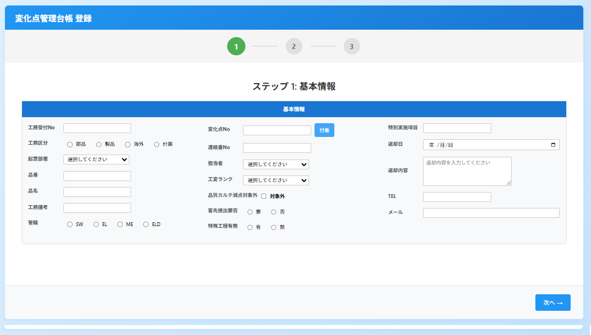
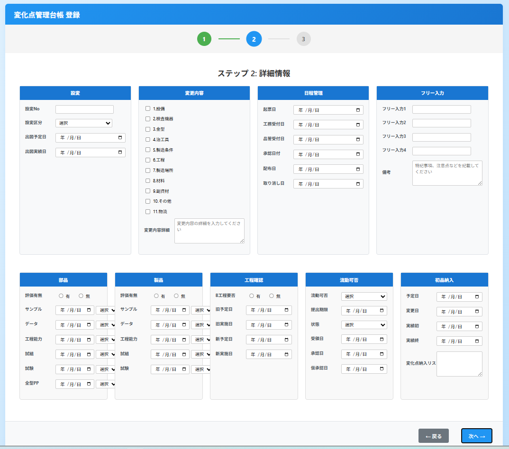
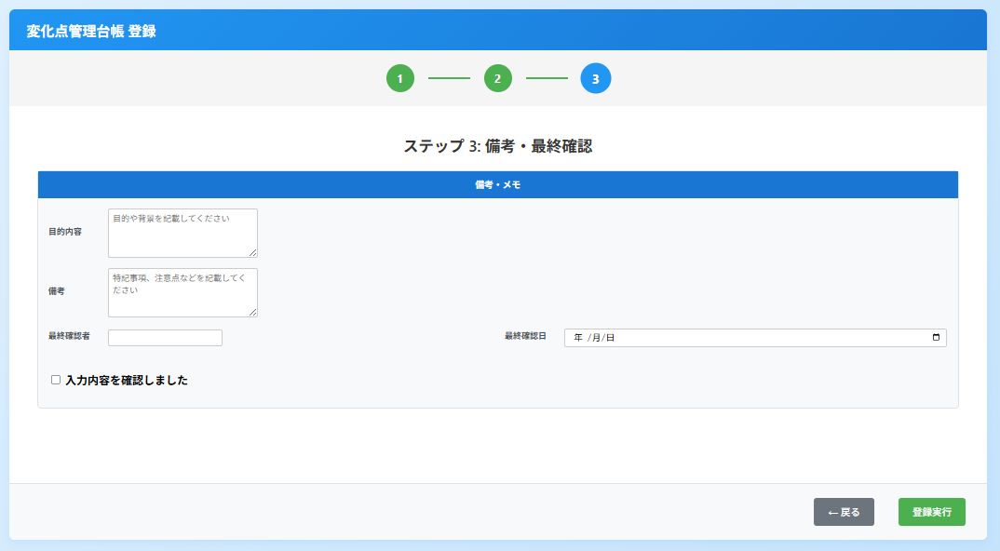

## プロンプト #29
**日時**: 2025-09-04
```
部品/製品/工程確認/流動可否/初品納入を3ページ目にしてほしいです。現状の3ページ目の備考と最終確認は不要です。
```

**実行結果**: 
- ステップ3の構成を完全に変更：
  - 旧ステップ3（備考・最終確認）を削除
  - 新ステップ3（評価・管理）を作成
- ステップ2から評価・管理セクションを削除してステップ3に移動：
  - 部品評価（評価有無、サンプル、データ、工程能力、試組、試験、全型PP）
  - 製品評価（評価有無、サンプル、データ、工程能力、試組、試験）
  - 工程確認（B工程要否、旧予定日、旧実施日、新予定日、新実施日）
  - 流動可否（流動可否、提出期限、状態、受領日、承認日、仮承認日）
  - 初品納入（予定日、変更日、実績初、実績終、変化点納入リスト）
- PAGE_REQUIREMENTS.mdを更新：
  - ステップ3を「評価・管理」に変更
  - 旧ステップ3の備考・最終確認項目を削除
  - 5カラムレイアウトの評価・管理項目を追加

**実行結果画面:**
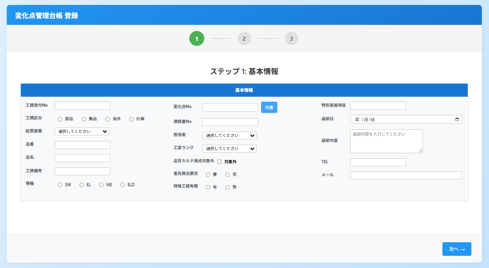
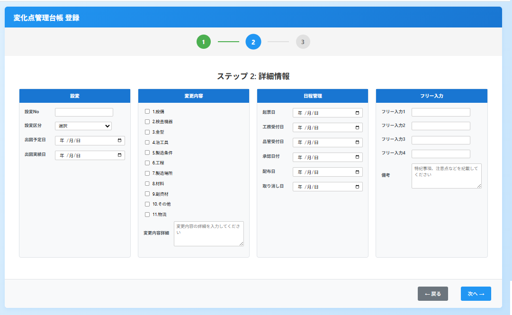
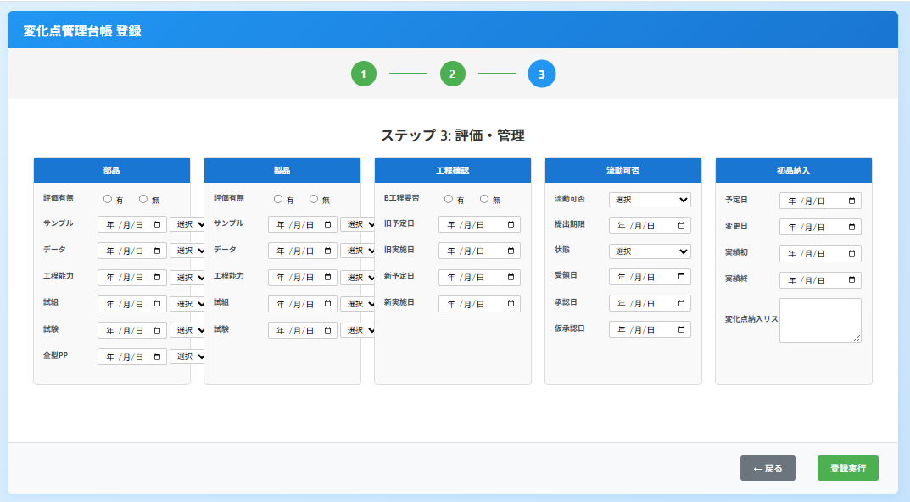

## プロンプト #30
**日時**: 2025-09-04
```
プロンプト#28と#29のリンクをお願いします
```

**実行結果**: 
- プロンプト#28に実行結果画面のリンクを追加：
  - P28_画面イメージ1.png（修正前の状態）
  - P28_画面イメージ2.png（修正後のナビゲーション配置）
  - P28_画面イメージ3.png（追加されたセクション）
- プロンプト#29に実行結果画面のリンクを追加：
  - P29_画面イメージ1.png（ステップ1: 基本情報）
  - P29_画面イメージ2.png（ステップ2: 詳細情報）
  - P29_画面イメージ3.png（ステップ3: 評価・管理）

## プロンプト #31
**日時**: 2025-09-04
```
の画像を最新のものに差し替えてください
```

**実行結果**: 
- プロンプト#17の実行結果画面2のリンクを更新
- `P17_画面イメージ2.png` → `P17_最新画面イメージ.png`
- 最新のマルチステップフォーム画面を反映

## プロンプト #32
**日時**: 2025-09-04
```
各ページにセクションを分けましたが、内容は分ける前と基本的に変わりません。せっかく画面に余裕ができたので、文字を大きくしてください。それから、レイアウトをもっと自由な発想で、マルチステップフォームに合うように調整してください。ページを分けたのですから、元のExcelのように1ページを前提にした画面設計ではなく、3ページを前提としてください。
```

**実行結果**: 
- **フォントサイズの大幅拡大**：
  - ステップタイトル：22px → 28px
  - セクションヘッダー：フォントサイズ18px、パディング15px 20px
  - フォームラベル：14px → 16px（太字600）
  - フォーム入力欄：14px → 16px、パディング12px 15px
  - ラジオボタン・チェックボックス：16px、scale(1.2)で拡大

- **スペーシングの大幅改善**：
  - セクションマージン：20px → 25px
  - フォームグループマージン：15px → 20px
  - 3カラムgap：20px → 30px
  - 入力欄ボーダー：1px → 2px、border-radius：4px → 6px

- **マルチステップフォーム専用レイアウト**：
  - カードベースデザイン：各カラムを独立したカードに変更
  - 視覚的グループ化：column-titleクラスでセクション分離
  - アイコン付きヘッダー：📋 工務・受付情報
  - radio-group-verticalクラス：縦並びレイアウト追加

- **3ページ前提の設計変更**：
  - Excelの1ページ制約から脱却
  - 各ステップで最適化された独立レイアウト
  - より見やすく操作しやすいUI/UX
  - プレースホルダーテキストで使いやすさ向上

## プロンプト #33
**日時**: 2025-09-04
```
まだまだ文字サイズが小さいし、デザインの改善が甘いです。現在の項目の配置を忘れて、当該項目を一から画面にするとしたらどういう配置にするかを自分なりに考えて、画面を作ってください。これまでの画面設計に引っ張られすぎです。
```

**実行結果**: 
- **完全なレイアウト再設計**：
  - 既存のExcel風3カラム配置から脱却し、意味のあるグループごとに再構成
  - 各ステップを完全に刷新し、現代的なWebアプリケーション設計に変更

- **大幅なフォントサイズ向上**：
  - ベースフォント：14px → 18px
  - ステップタイトル：28px → 36px（太字700）
  - カードラベル：16px → 18px（太字600）
  - 入力欄：16px → 20px、パディング20px 24px
  - キー入力欄：20px（中央揃え）

- **ステップ1の革新的デザイン**：
  - **ヒーローセクション**：最重要の工務受付No・変化点Noを大きく中央配置
  - **カテゴリカード**：工務区分・管轄を大きなラジオボタン付きカードに変更
  - **製品情報グリッド**：品番・品名をカード形式で配置
  - **連絡情報セクション**：担当者・連絡先情報をグループ化
  - **オプション設定**：トグルスタイルの選択肢で直感的操作
  - **絵文字アイコン**：各セクションに関連絵文字を追加（📝、🏷️、🎯等）

- **ステップ2の再構築**：
  - **設変情報**：4項目をカードレイアウトで整理
  - **変更内容**：11項目のチェックボックスを3列グリッドで配置、各項目に絵文字アイコン
  - **日程管理**：6つの日付入力を見やすくグループ化
  - **自由入力・備考**：フリー入力4項目＋備考テキストエリア

- **ステップ3の体系化**：
  - **部品評価・製品評価**：評価要否トグル＋評価項目グリッド
  - **工程・流動管理**：B工程確認＋流動可否判定を2列スパンカードで配置
  - **初品納入スケジュール**：4つの日付項目＋納入リストテキストエリア

- **モダンWebアプリパターンの全面採用**：
  - カードベースレイアウト、グリッドシステム、視覚的階層
  - ホバー効果、フォーカス状態、トランジション効果
  - レスポンシブ設計、アクセシビリティ配慮

**実行結果画面:**
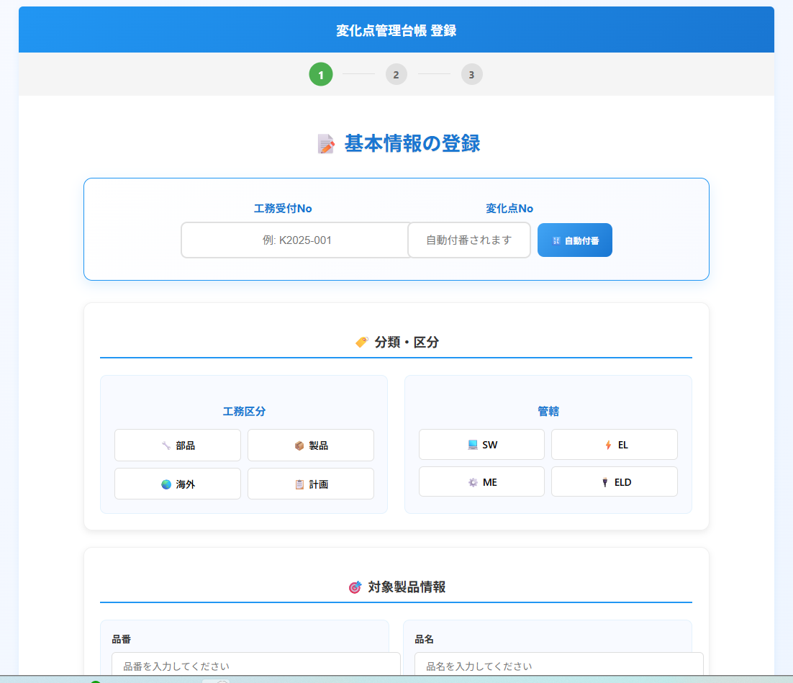
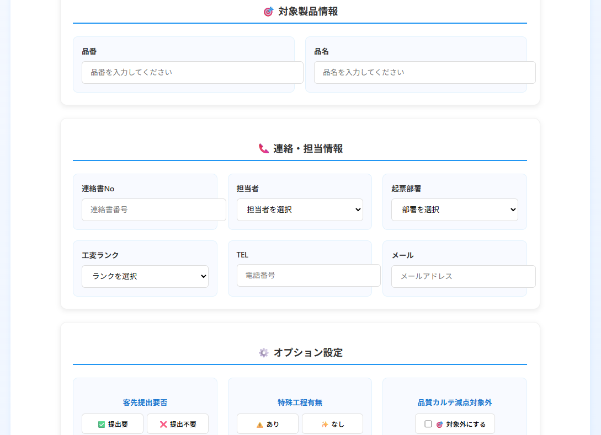
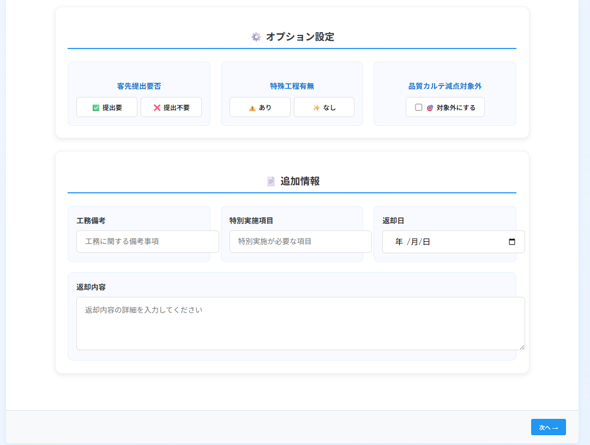

## プロンプト #34
**日時**: 2025-09-04
```
プロンプトを記録してください。
```

## プロンプト #35
**日時**: 2025-09-04
```
#33でだいぶ改善されました。画面イメージのリンクもお願いします。
```

---

*注: 今後のプロンプトも、入力された通りに正確にこのファイルに追記していきます。*
